# NeoBrutal UI Components for Jetpack Compose

A modern Jetpack Compose UI library featuring Neo-Brutalist design principles with bold geometric shapes, thick borders, high contrast colors, and distinctive shadow effects.

[](https://jitpack.io/#zahid4kh/neobrutal-lib)

## Introduction

NeoBrutal-lib is a collection of UI components for Jetpack Compose that embraces Neo-Brutalism design principles:

- Bold, geometric shapes with sharp corners
- High contrast colors
- Thick borders and visible structure
- Distinctive shadow effects for a 3D appearance
- Monospaced typography
- Raw, unpolished aesthetic

This library provides ready-to-use components that follow these design principles, allowing you to create distinctive, eye-catching UIs for your Android applications.

## Installation

### Step 1. Add the JitPack repository

Add the JitPack repository to your **settings.gradle.kts** file:

```kotlin
dependencyResolutionManagement {
    repositoriesMode.set(RepositoriesMode.FAIL_ON_PROJECT_REPOS)
    repositories {
        mavenCentral()
        maven { url = uri("https://jitpack.io") }
    }
}
```

### Step 2. Add the dependency

Add the dependency to your app module's **build.gradle.kts** file:

```kotlin
dependencies {
    implementation("com.github.zahid4kh:neobrutal-lib:1.0.5")
}
```

## Components

### Buttons

#### NeoButton

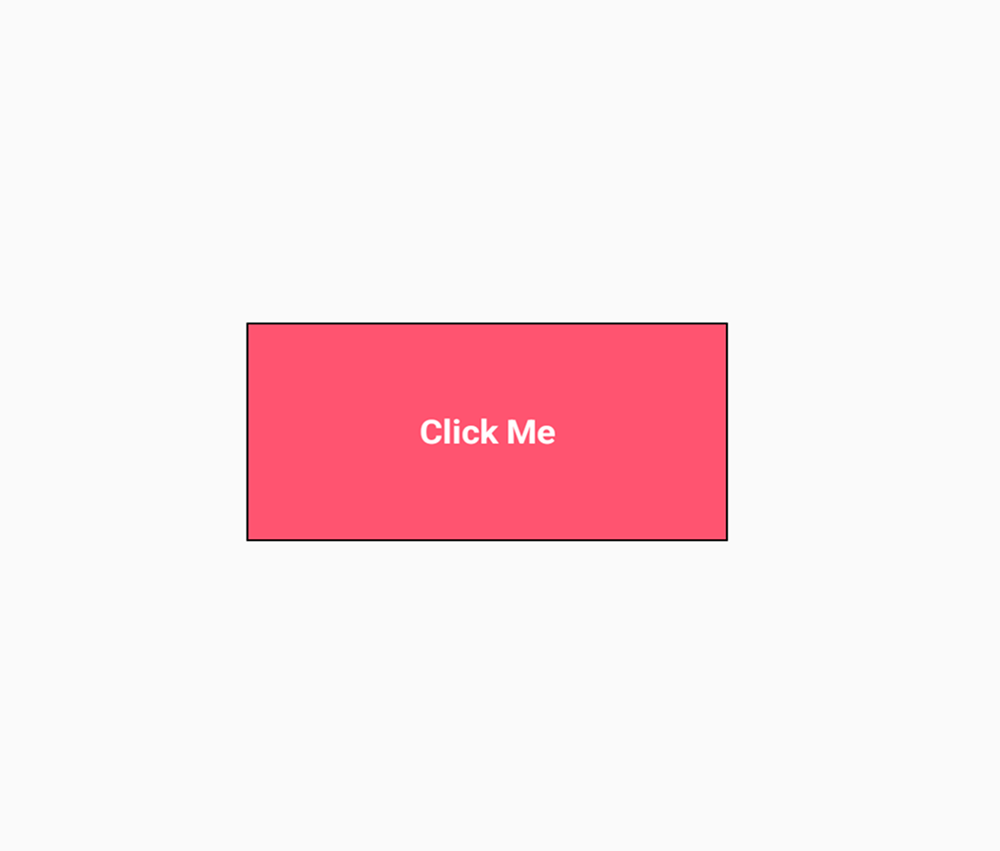

A standard button with the characteristic NeoBrutal 3D effect.
(shadow must be fixed)

```kotlin
NeoButton(
    text = "Click Me",
    onClick = { /* Your click handler */ },
    backgroundColor = Color(0xFFFF5470),
    textColor = Color.White
)
```

#### NeoIconButton

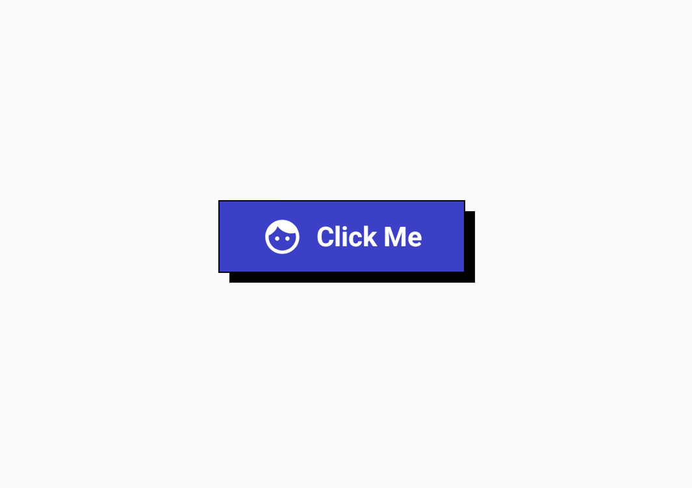

A button with an icon and optional text.
(width&height must be dynamic)

```kotlin
NeoIconButton(
    icon = Icons.Default.Face,
    onClick = { /* Your click handler */ },
    text = "Click Me"
)
```

#### NeoOutlinedButton

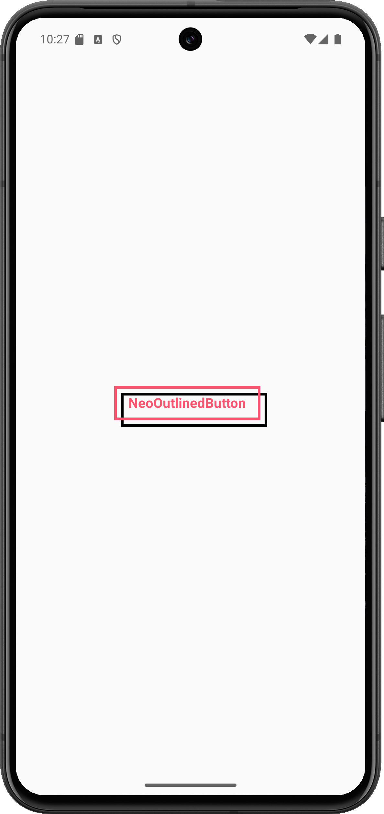

An outlined button variant with transparent background.

```kotlin
NeoOutlinedButton(
    text = "NeoOutlinedButton",
    onClick = { /* Your click handler */ }
)
```

#### NeoToggleButton


A toggleable button that changes appearance based on its state.

```kotlin
var isActive by remember { mutableStateOf(false) }

NeoToggleButton(
    text = "NeoToggleButton",
    onToggle = { isActive = it },
    isActive = isActive
)
```

### Input Components

#### NeoTextField

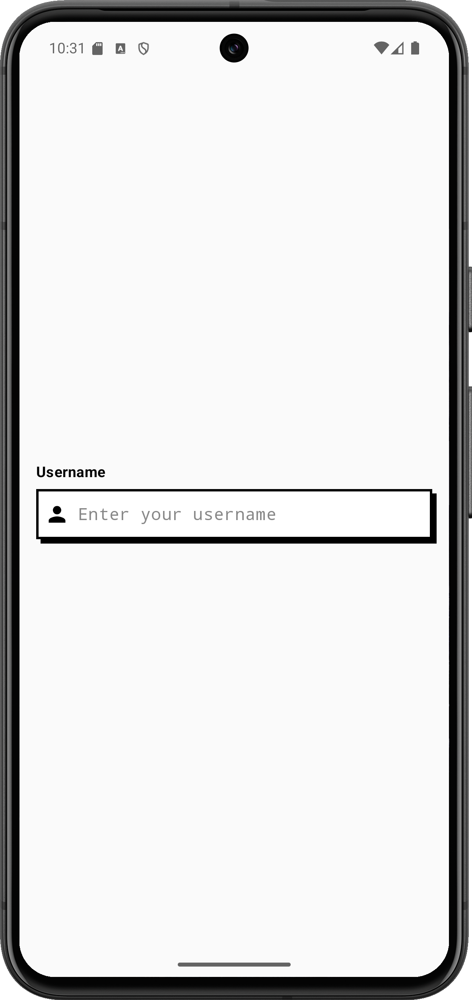

A text input field with bold borders and shadow effects.

```kotlin
var textValue by remember { mutableStateOf("") }

NeoTextField(
    value = textValue,
    onValueChange = { textValue = it },
    modifier = Modifier.fillMaxWidth().padding(horizontal = 16.dp),
    label = "Username",
    placeholder = "Enter your username",
    leadingIcon = Icons.Default.Person
)
```

#### NeoPasswordTextField

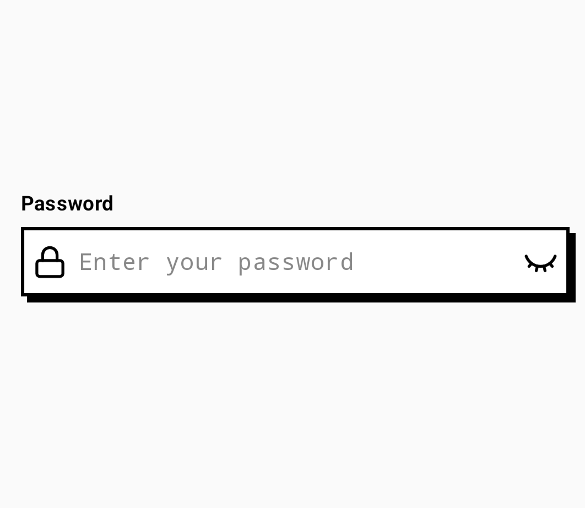

A specialized text field for password input with visibility toggle.

```kotlin
var passwordValue by remember { mutableStateOf("") }
val passwordErrorState = remember { mutableStateOf(false) }

NeoPasswordTextField(
    value = passwordValue,
    onValueChange = { passwordValue = it },
    modifier = Modifier.fillMaxWidth().padding(horizontal = 16.dp),
    isError = passwordErrorState
)
```

#### NeoEmailTextField

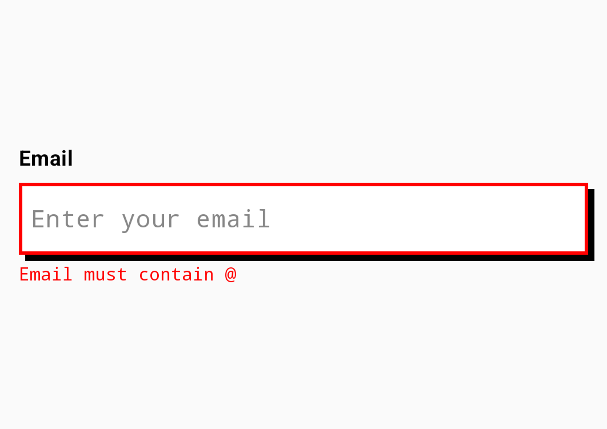

An email input field with validation that checks for the presence of '@' character.

```kotlin
var emailValue by remember { mutableStateOf("") }
val emailErrorState = remember { mutableStateOf(false) }

NeoEmailTextField(
    value = emailValue,
    onValueChange = { emailValue = it },
    modifier = Modifier.fillMaxWidth().padding(horizontal = 16.dp),
    isError = emailErrorState,
    errorMessage = "Email must contain @"
)
```

#### NeoEmailPasswordTextField

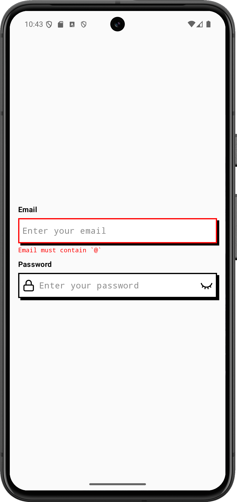

A combined component that includes both email and password fields with validation.

```kotlin
var emailValue by remember { mutableStateOf("") }
var passwordValue by remember { mutableStateOf("") }
val emailErrorState = remember { mutableStateOf(false) }
val passwordErrorState = remember { mutableStateOf(false) }

NeoEmailPasswordTextField(
    emailValue = emailValue,
    onEmailValueChange = { emailValue = it },
    isEmailError = emailErrorState,
    passwordValue = passwordValue,
    onPasswordValueChange = { passwordValue = it },
    isPasswordError = passwordErrorState,
    modifier = Modifier.fillMaxWidth().padding(horizontal = 16.dp)
)
```

#### NeoSlider

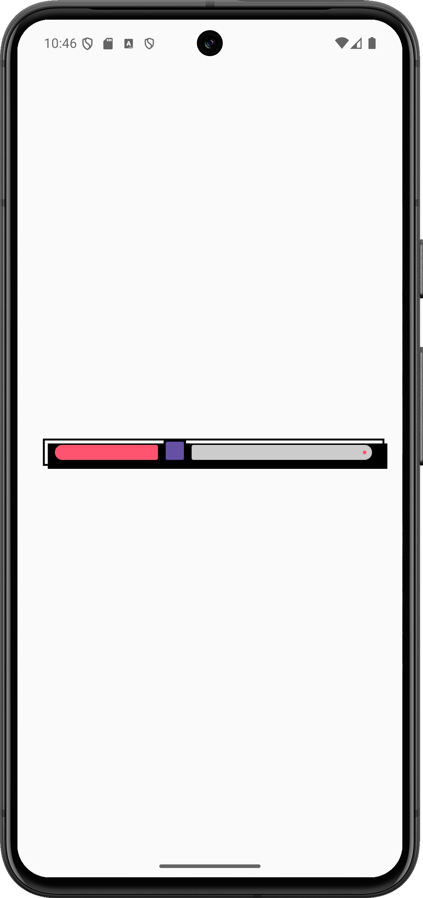

A slider with a bold track and thumb design.

```kotlin
var sliderValue by remember { mutableFloatStateOf(0f) }

NeoSlider(
    value = sliderValue,
    onValueChange = { sliderValue = it },
    trackHeight = 27.dp,
    activeTrackColor = Color(0xFFFF5470)
)
```

#### NeoCheckbox

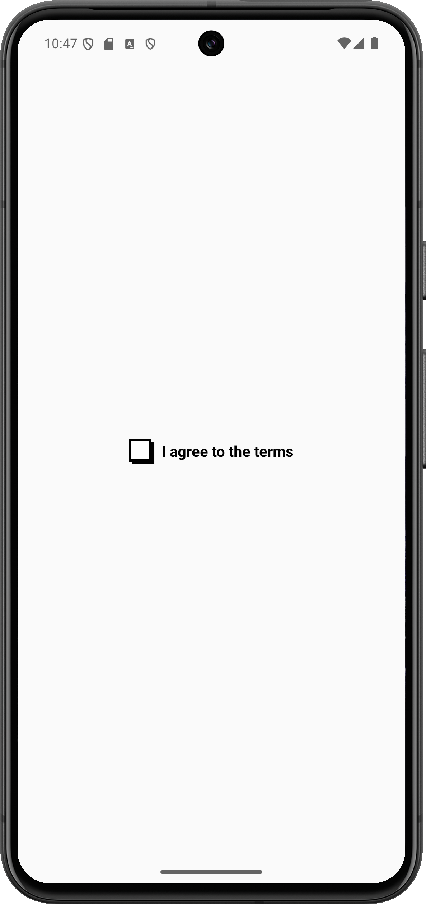

A checkbox with thick borders and bold visual feedback.

```kotlin
var isChecked by remember { mutableStateOf(false) }

NeoCheckbox(
    checked = isChecked,
    onCheckedChange = { isChecked = it },
    text = "I agree to the terms"
)
```

### Cards

#### NeoBasicCard

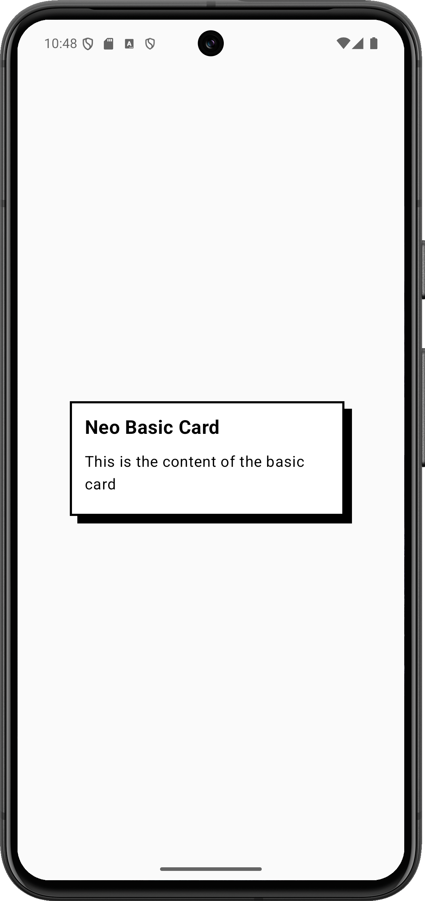

A simple card with title and content.

```kotlin
NeoBasicCard(
    title = "Neo Basic Card",
    content = {
        Text("This is the content of the basic card")
    }
)
```

#### NeoMediaCard

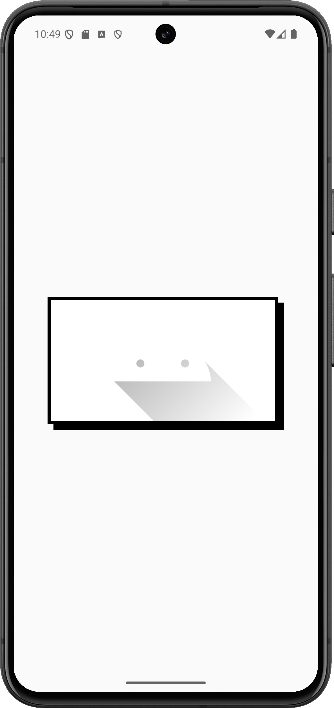

A card that displays an image with title, description, and actions.
(width&height must be dynamic)

```kotlin
NeoMediaCard(
    image = painterResource(R.drawable.your_image),
    title = "Media Card",
    description = "This is a media card",
    actions = {
        Row(
            modifier = Modifier.fillMaxWidth(),
            horizontalArrangement = Arrangement.SpaceEvenly
        ) {
            IconButton(onClick = {}) {
                Icon(Icons.Default.Favorite, contentDescription = null)
            }
            IconButton(onClick = {}) {
                Icon(Icons.Default.Share, contentDescription = null)
            }
        }
    }
)
```

#### NeoProfileCard

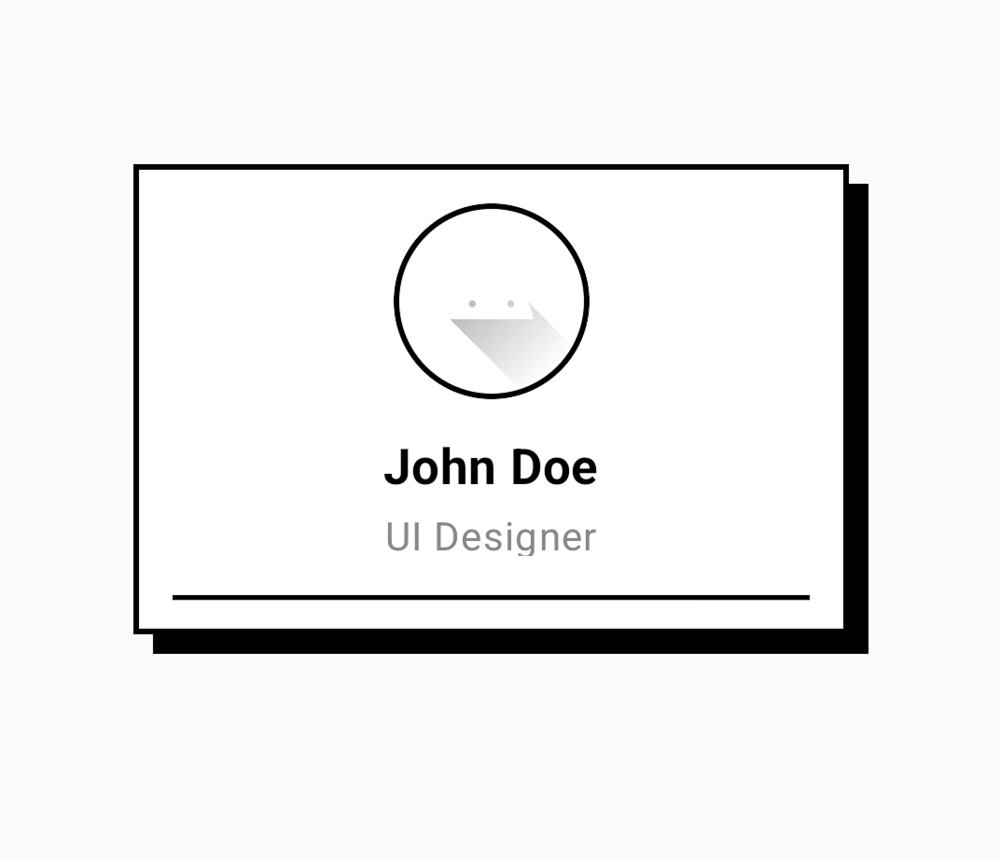

A card designed to display user profiles.
(width&height must be dynamic)

```kotlin
NeoProfileCard(
    avatar = painterResource(R.drawable.profile_avatar),
    name = "John Doe",
    title = "UI Designer",
    actions = {
        Row(
            modifier = Modifier.fillMaxWidth(),
            horizontalArrangement = Arrangement.SpaceEvenly
        ) {
            IconButton(onClick = {}) {
                Icon(Icons.Default.Favorite, contentDescription = null)
            }
            IconButton(onClick = {}) {
                Icon(Icons.Default.Message, contentDescription = null)
            }
        }
    }
)
```

#### NeoActionCard

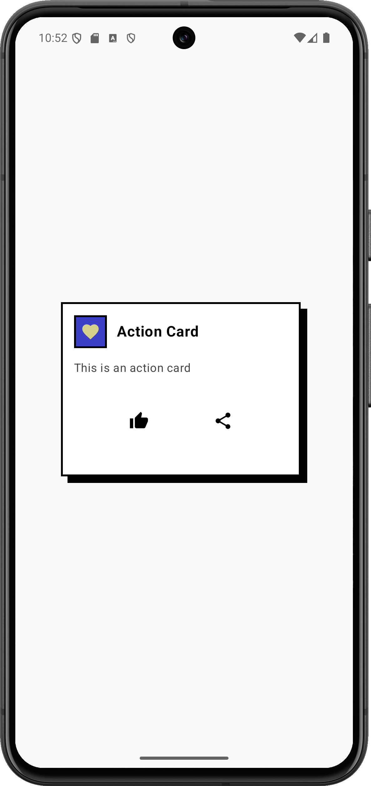

A card with an icon, title, description, and action buttons.
(width&height must be dynamic)

```kotlin
NeoActionCard(
    icon = Icons.Default.Favorite,
    title = "Action Card",
    description = "This is an action card",
    actions = {
        Row(
            modifier = Modifier.fillMaxWidth(),
            horizontalArrangement = Arrangement.SpaceEvenly
        ) {
            IconButton(onClick = {}) {
                Icon(Icons.Default.ThumbUp, contentDescription = null)
            }
            IconButton(onClick = {}) {
                Icon(Icons.Default.Share, contentDescription = null)
            }
        }
    }
)
```

#### NeoExpandableCard

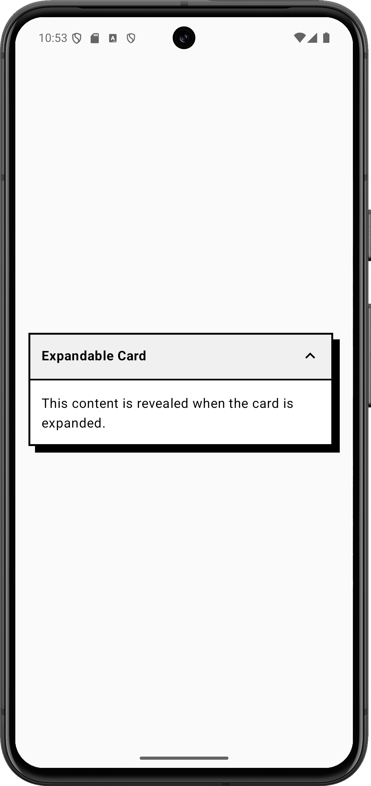

A card that can be expanded to show additional content.

```kotlin
NeoExpandableCard(
    title = "Expandable Card",
    initiallyExpanded = false,
    content = {
        Text("This content is revealed when the card is expanded.")
    },
    modifier = Modifier.padding(horizontal = 16.dp)
)
```

## Customization

Each component in the NeoBrutal library offers extensive customization options including:

- Colors (background, text, borders, shadows)
- Dimensions (size, padding, shadow offset)
- Typography (font size, weight, family)
- Shapes (though Neo-Brutalism typically prefers rectangles)

You can refer to the KDoc comments in each component for the full list of customization parameters.

## License

```
MIT License

Copyright (c) 2025 Zahid

Permission is hereby granted, free of charge, to any person obtaining a copy
of this software and associated documentation files (the "Software"), to deal
in the Software without restriction, including without limitation the rights
to use, copy, modify, merge, publish, distribute, sublicense, and/or sell
copies of the Software, and to permit persons to whom the Software is
furnished to do so, subject to the following conditions:

The above copyright notice and this permission notice shall be included in all
copies or substantial portions of the Software.

THE SOFTWARE IS PROVIDED "AS IS", WITHOUT WARRANTY OF ANY KIND, EXPRESS OR
IMPLIED, INCLUDING BUT NOT LIMITED TO THE WARRANTIES OF MERCHANTABILITY,
FITNESS FOR A PARTICULAR PURPOSE AND NONINFRINGEMENT. IN NO EVENT SHALL THE
AUTHORS OR COPYRIGHT HOLDERS BE LIABLE FOR ANY CLAIM, DAMAGES OR OTHER
LIABILITY, WHETHER IN AN ACTION OF CONTRACT, TORT OR OTHERWISE, ARISING FROM,
OUT OF OR IN CONNECTION WITH THE SOFTWARE OR THE USE OR OTHER DEALINGS IN THE
SOFTWARE.
```